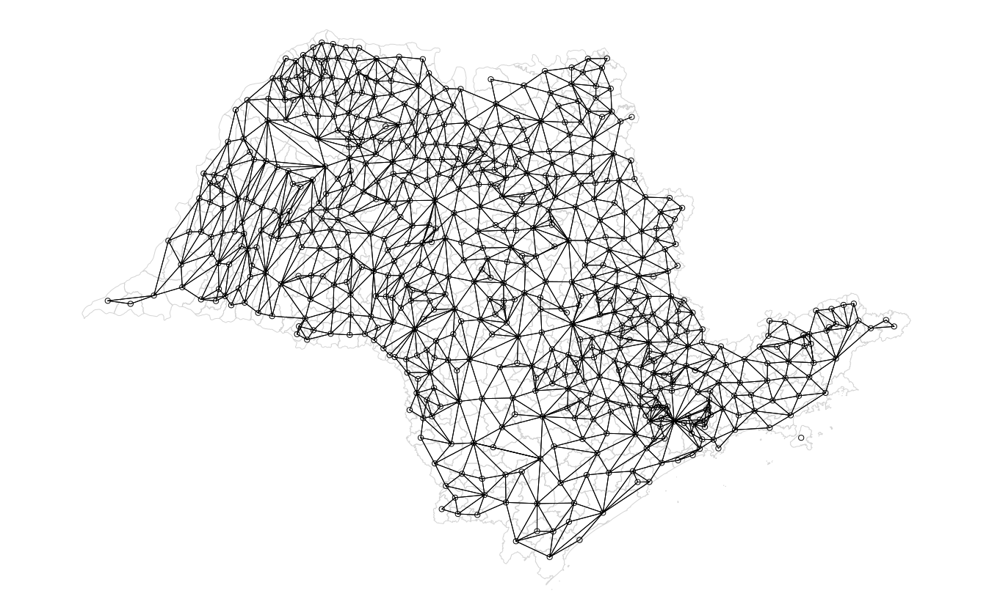
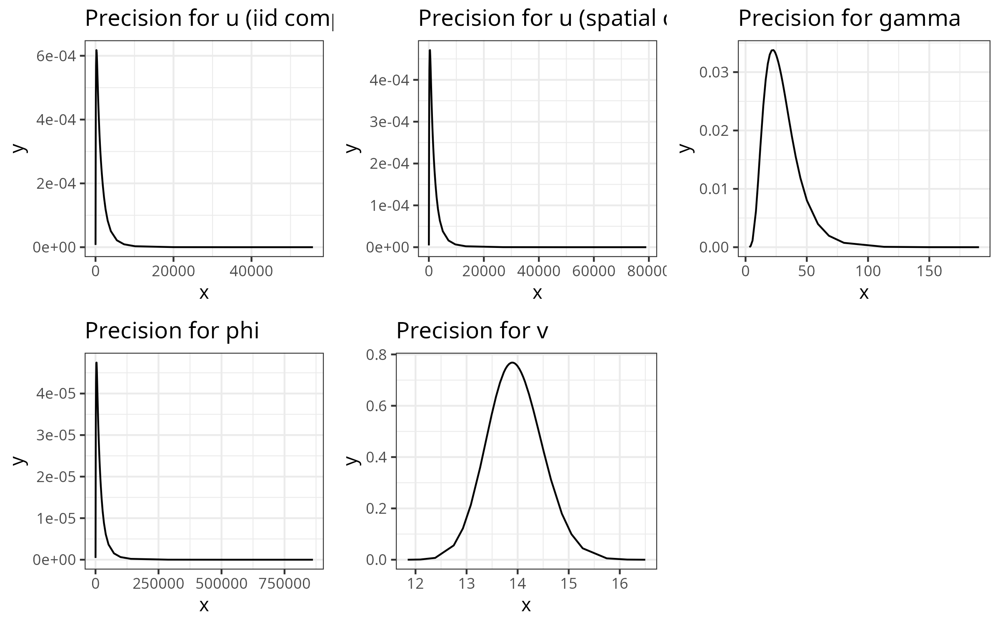
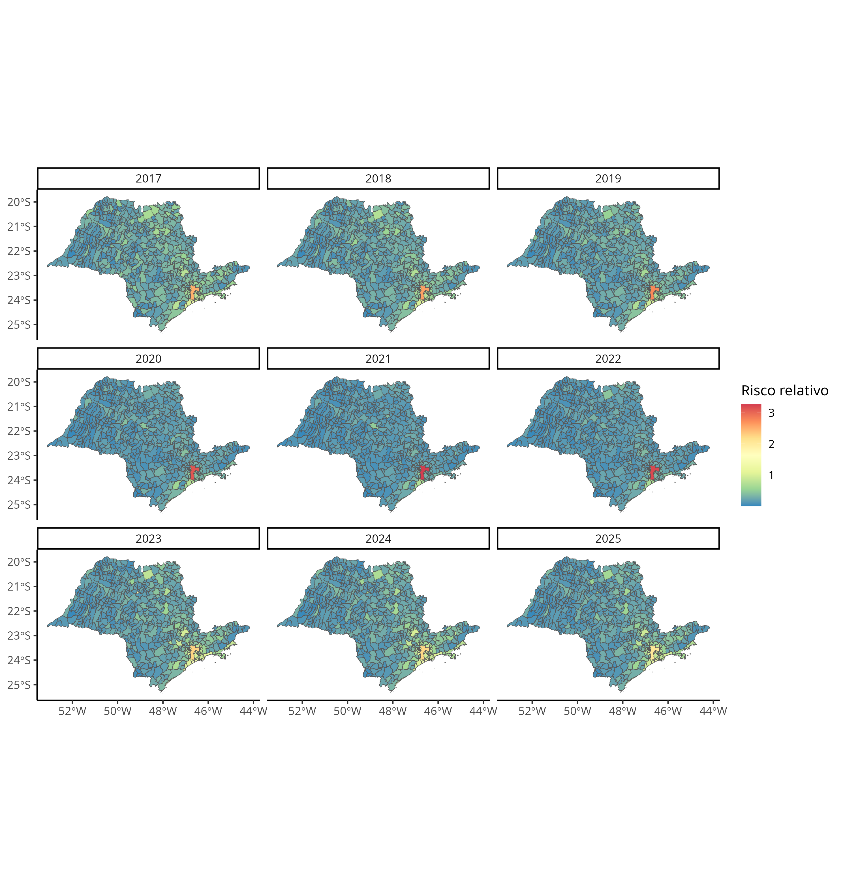
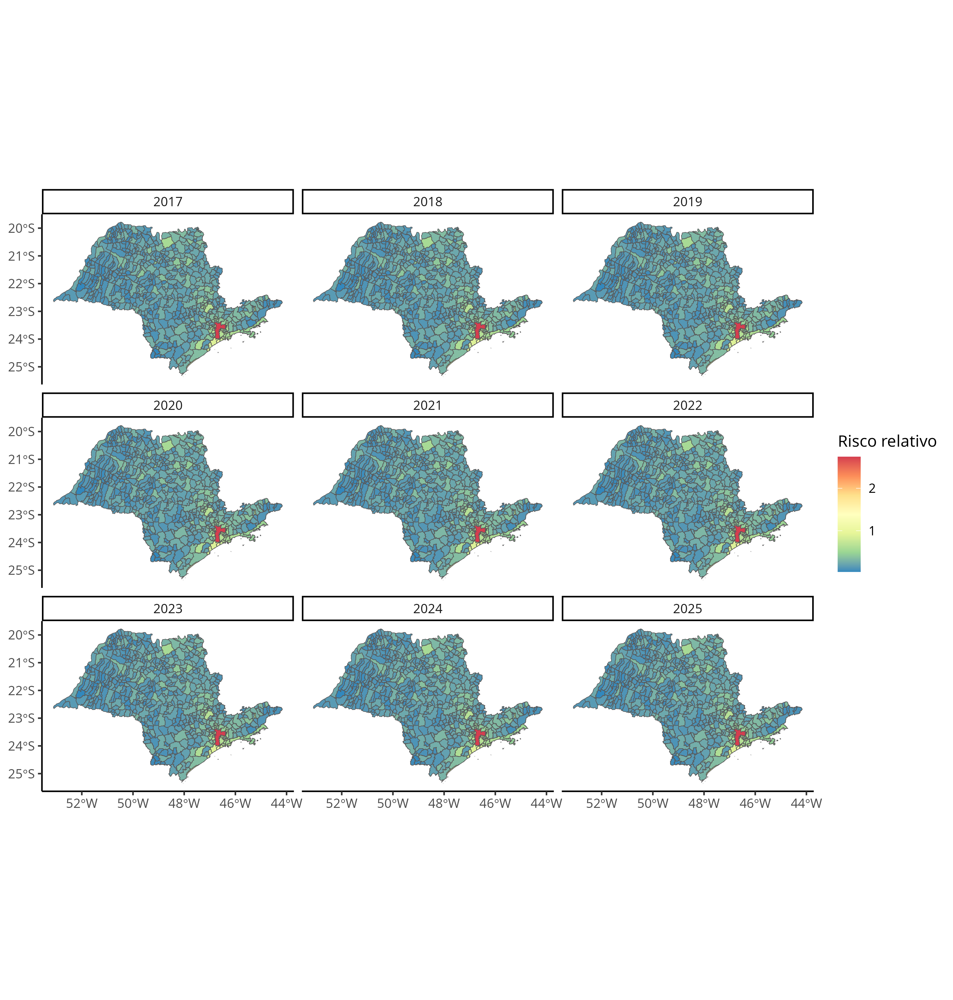
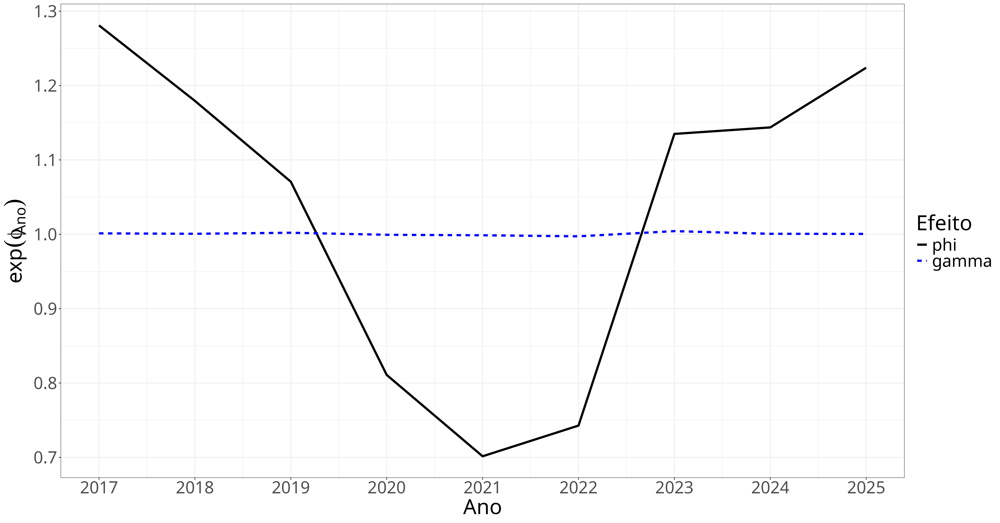

```{r}
#| label: cache
#| cache: true
load("~/Mestrado/Bayesiana/Trabalho/.RData")
```

```{r}
#| label: setup
#| echo: false
library(tidyverse)
```

# Introdução

## Motivação

- Secretaria de Segurança Pública do Estado de São Paulo disponibiliza online os registros de roubos de celulares que geraram boletins de ocorrência;

- Os dados compõem 8 arquivos, um para cada ano entre 2017 e 2024, contendo um BO e suas informações georreferenciadas por linha;

- Uma maneira de determinar o quão perigosa é uma região é por meio da estimação do risco relativo de roubo.

## Motivação

- Não queremos, no entanto, um modelo para cada ano, e sim um que incorpore o efeito temporal presente de maneira inerente nos dados;

- Modelagem espaço-temporal é complicada, pois exige a especificação da interação entre processos que são, de maneira independe, complexos;

- O uso de inferência bayesiana é uma forma de acomodar diferentes abordagens que podem ajudar a modelagem.

# Metodologia

## Conjunto de dados

### Problema {.alert}

Roubos ocorridos em regiões como parques e metrôs não possuem latitude/longitude associadas, gerando quantidade considerável  de *missing* (aproximadamente 50% em certas regiões).

### Solução {.example}

Aglomerar as ocorrências por município, e considerar uma estrutura espacial areal.

## Matriz de adjacência



## Conjunto de dados

Após tratamento das bases, obtivemos a seguinte estrutura:

```{r}
#| label: dados_anuais
roubos_sp_total[c(1, 109, 546, 645), 1:6] %>%
    remove_rownames() %>%
    select("Município" = NM_MUN, everything()) %>%
    knitr::kable(format = "latex")
```

## Medida de incidência

- Uma maneira de indicar o risco de roubo é por meio do **SIR**: *Standardized Incidence Ratio*, dado por:

\begin{equation*}
SIR_{it} = \frac{Y_{it}}{E_{it}}
\end{equation*}

- Onde $Y_{it}$ é a contagem de casos (roubos) e $E_{it}$ é a expectativa de casos no município $i$ no ano $t$, obtida por padronização indireta.

## Modelo

- O modelo foi construído para estimar a contagem de roubos a partir da seguinte relação:

\begin{align*}
Y_{it} &\sim \mathrm{Pois}(E_{it}\theta_{it}) \\
\log(\theta_{it}) &= X_{it}\beta + u_{i} + v_{i} + \phi_{t} + \gamma_{t} + \delta_{it}
\end{align*}

- Onde $\beta$ é um vetor de parâmetros da regressão, $u_{i},v_{i}$ são efeitos aleatórios espaciais, $\gamma_{t},\phi_{t}$ são efeitos aleatórios temporais e $\delta_{it}$ é um efeito de interação espaço-temporal.

## Efeitos espaciais

- Os efeitos espacialmente correlacionados $u_{i}$ seguem um modelo Condicional Autorregressivo BYM [@besag_et_al_1991], dado por:

\begin{equation*}
u_{i}|u_{-i} \sim N\left(\bar{u}_{\nu_{i}},\frac{\sigma_{u}^{2}}{n_{\nu_{i}}}\right)
\end{equation*}

- Onde $\bar{u}_{\nu_{i}} = n_{\nu_{i}}^{-1}\sum_{j \in \nu_{i}}u_{j}$, com $\nu_{i}$ e $n_{\nu_{i}}$ representando o conjunto e a quantidade de vizinhos do município $u_{i}$.

## Efeitos temporais

- Os efeitos temporalmente correlacionados $\phi_{t}$ seguem um modelo *Random Walk* de ordem 1, dado por:

\begin{equation*}
\phi_{t}|\phi_{t-1} \sim N\left(\phi_{t-1},\sigma_{\phi}^{2}\right)
\end{equation*}

- Inicialmente foi proposto um modelo Autorregressivo AR(1), porém modelos *Random Walk* possuem estrutura de posto completo, auxiliando a estimação.

## Efeitos não-correlacionados

- Os efeitos espaciais e temporais não-correlacionados $v_{i},\gamma_{t}$ seguem distribuição Normal, com médias 0 e variâncias $\sigma_{v}^{2},\sigma_{\gamma}^{2}$:

\begin{gather*}
v_{i} \sim N(0,\sigma^{2}_{v}) \\
\gamma_{t} \sim N(0,\sigma^{2}_{\gamma})
\end{gather*}

## Interação espaço-temporal

- Knorr-Held propõe 4 tipos de interações espaço-temporais $\delta_{it}$, entre os seguintes efeitos:


```{r}
#| label: tabela_1
#| echo: false
#| output: asis
mat <- data.frame(
    `Tipo de interação` = c("Tipo I", "Tipo II",
                            "Tipo III", "Tipo IV"),
    `Efeito espacial` = c("$v_{i}$", "$v_{i}$",
                          "$u_{i}$", "$u_{i}$"),
    `Efeito temporal` = c("$\\gamma_{t}$", "$\\phi_{t}$",
                          "$\\gamma_{t}$", "$\\phi_{t}$")
) %>%
    remove_rownames()
mat <- xtable::xtable(mat)
print(mat, sanitize.text.function = function(x) {x},
      comment = FALSE, include.rownames = FALSE)
```

## Modelagem

- O modelo foi ajustado utilizando o pacote `R-INLA`, com auxílio dos pacotes `spdep`, `sf` e `SpatialEpi` para tratamento dos dados espaciais e `tidyverse` para manipulação das bases;

- Esse método foi formulado para ajuste de modelos gaussianos latentes, porém nos últimos anos a quantidade de diferentes aplicações foi aumentada;

- A abordagem do INLA envolve o paradigma bayesiano, porém por meio de aproximações numéricas ao invés de algoritmos de amostragem.

# INLA

## Introdução

- INLA (*Integrated Nested Laplace Approximation*) foi desenvolvido e proposto por [@rue_2009];

- A ideia central é aproximar as distribuições marginais a posteriori para cada parâmatro, ao invés de encontrar a distribuição conjunta a posteriori;

- Dessa forma, pula-se o passo de obtenção de amostras MCMC (por Amostrador de Gibbs, por exemplo) para estimação dos parâmetros, diminuindo assim o tempo computacional necessário para modelagem.

## Estimação das marginais

- Assim, sejam $y \in \mathbb{R}$ o vetor de observações, $x \in \mathbb{R}^{n}$ um vetor de variáveis latentes e $\theta \in \mathbb{R}^{p}$ um vetor de hiperparâmetros. Temos pelo Teorema de Bayes que:

\begin{equation*}
p(x,\theta|y) \propto p(\theta)p(x|\theta)p(y|x,\theta)
\end{equation*}

- O interesse no INLA é de obter as distribuições marginais, ou seja:

\begin{align*}
p(x_i|y) &= \int p(x_i|\theta)p(\theta|y)d\theta \approx \int \tilde p(x_i|\theta) \tilde p(\theta|y)d\theta\\
p(\theta_j|y) &= \int p(\theta|y)d\theta_{-j} \approx \int \tilde p(\theta|y)d\theta_{-j}
\end{align*}

## Aproximações

- Nesse passo é utilizada a Aproximação de Laplace, que busca aproximar essas distribuições por meio de uma Gaussiana centrada na moda;

- Para isso, a moda a posteriori ($\theta^{*}$) de $p(\theta|y)$ é obtida maximizando $\log(p(\theta|y))$, usualmente por algum método de Quase-Newton;

- Após isso, algum método de diferenças finitas é usado para estimar o valor negativo do hessiano $\bold{H}$.

## Aproximações

- Com isso, é possível encontrar a decomposição do valor singular de $\bold{H}^{-1}$, dada por $\bold{H}^{-1} = V \Lambda V'$;

- Então, é feito o reescalonamento de $\theta$, através de $\theta(z) = \theta^{*}+V \Lambda^{1/2}z$, que facilita a exploração de $\theta$, corrigindo a escala e rotação;

- Finalmente, $\log(p(\theta|y))$ é explorada utilizando a parametrização de $(z)$.

## Exploração de $\theta$

- O principal método para exploração de $\log(p(\theta|y))$ é por meio de um *grid* regular centrado na moda;

- Os pontos são considerados para a integração numérica se o seguinte critério for atendido:

\begin{equation*}
|\log(p(\theta(0)|y)) - \log(p(\theta(z)|y))| < \epsilon, \epsilon > 0
\end{equation*}

- Outros métodos otimizam a escolha de pontos no *grid*, principalmente quando o número de hiperparâmetros aumenta.

## Exploração de $\theta$

```{r, engine='tikz'}
#| label: imagem_inla0
#| layout-ncol: 2
\begin{tikzpicture} [domain = 0:5]
\draw[very thin, color = gray] (0, -1) grid (5, 4);
\draw[->] (-0.2, 0) -- (5.2, 0) node[right] {$\theta_{1}$};
\draw[->] (0, -1.2) -- (0, 4.2) node[above] {$\theta_{2}$};
\foreach \r in {5, 10, ..., 40}{
    \draw[color = gray, rotate around = {-45:(12/5,8/5)}] (12/5, 8/5) circle (2 * \r pt and \r pt);
}
\fill[color = red] (12/5, 8/5) circle (2pt) node[right] {$\theta^{*}$};
\end{tikzpicture}
```

## Exploração de $\theta$

```{r, engine='tikz'}
#| label: imagem_inla1
#| layout-ncol: 2
\begin{tikzpicture} [domain = 0:5]
\draw[very thin, color = gray] (0, -1) grid (5, 4);
\draw[->] (-0.2, 0) -- (5.2, 0) node[right] {$\theta_{1}$};
\draw[->] (0, -1.2) -- (0, 4.2) node[above] {$\theta_{2}$};
\draw[dashed, domain = 1:4] plot (\x, 1.5 * \x - 2) node[right] {$z_{1}$};
\draw[dashed, domain = 0:5] plot (\x, -1 * \x + 4) node[right] {$z_{2}$};
\foreach \r in {5, 10, ..., 40}{
    \draw[color = gray, rotate around = {-45:(12/5,8/5)}] (12/5, 8/5) circle (2 * \r pt and \r pt);
}
\fill[color = red] (12/5, 8/5) circle (2pt);
\end{tikzpicture}
```

## Exploração de $\theta$

```{r, engine='tikz'}
#| label: imagem_inla2
#| layout-ncol: 2
\begin{tikzpicture} [domain = 0:5]
\draw[very thin, color = gray] (0, -1) grid (5, 4);
\draw[->] (-0.2, 0) -- (5.2, 0) node[right] {$\theta_{1}$};
\draw[->] (0, -1.2) -- (0, 4.2) node[above] {$\theta_{2}$};
\draw[dashed, domain = 1:4] plot (\x, 1.5 * \x - 2) node[right] {$z_{1}$};
\draw[dashed, domain = 0:5] plot (\x, -1 * \x + 4) node[right] {$z_{2}$};
\foreach \r in {5, 10, ..., 40}{
    \draw[color = gray, rotate around = {-45:(12/5,8/5)}] (12/5, 8/5) circle (2 * \r pt and \r pt);
}
\fill[color = red] (12/5, 8/5) circle (2pt);
\foreach \x in {1, 2, 3}{
    \fill (12/5 + 2 * \x/5, 8/5 - 2 * \x/5) circle (2pt);
    \fill (12/5 - 2 * \x/5, 8/5 + 2 * \x/5) circle (2pt);
}
\foreach \x in {1, 2}{
    \fill (12/5 + \x/5, 8/5 + 1.5 * \x/5) circle (2pt);
    \fill (12/5 - \x/5, 8/5 - 1.5 * \x/5) circle (2pt);
}
\end{tikzpicture}
```

## Exploração de $\theta$

```{r, engine='tikz'}
#| label: imagem_inla3
#| layout-ncol: 2
\begin{tikzpicture} [domain = 0:5]
\draw[very thin, color = gray] (0, -1) grid (5, 4);
\draw[->] (-0.2, 0) -- (5.2, 0) node[right] {$\theta_{1}$};
\draw[->] (0, -1.2) -- (0, 4.2) node[above] {$\theta_{2}$};
\draw[dashed, domain = 1:4] plot (\x, 1.5 * \x - 2) node[right] {$z_{1}$};
\draw[dashed, domain = 0:5] plot (\x, -1 * \x + 4) node[right] {$z_{2}$};
\foreach \r in {5, 10, ..., 40}{
    \draw[color = gray, rotate around = {-45:(12/5,8/5)}] (12/5, 8/5) circle (2 * \r pt and \r pt);
}
\fill[color = red] (12/5, 8/5) circle (2pt);
\foreach \x in {1, 2, 3}{
    \fill (12/5 + 2 * \x/5, 8/5 - 2 * \x/5) circle (2pt);
    \fill (12/5 - 2 * \x/5, 8/5 + 2 * \x/5) circle (2pt);
}
\foreach \x in {1, 2}{
    \fill (12/5 + \x/5, 8/5 + 1.5 * \x/5) circle (2pt);
    \fill (12/5 - \x/5, 8/5 - 1.5 * \x/5) circle (2pt);
}
\foreach \x in {1, 2}{
    \foreach \y in {1, 2, 3}{
        \fill[color = blue] (12/5 + 2 * \y/5 + \x/5, 8/5 - 2 * \y/5 + 1.5 * \x/5) circle (2pt);
        \fill[color = blue] (12/5 - 2 * \y/5 + \x/5, 8/5 + 2 * \y/5 + 1.5 * \x/5) circle (2pt);
        \fill[color = blue] (12/5 + 2 * \y/5 - \x/5, 8/5 - 2 * \y/5 - 1.5 * \x/5) circle (2pt);
        \fill[color = blue] (12/5 - 2 * \y/5 - \x/5, 8/5 + 2 * \y/5 - 1.5 * \x/5) circle (2pt);
    }
}
\end{tikzpicture}
```

## Aproximação

- Com os valores aproximados das distribuições é possível resolver as integrais numericamente, por meio da seguinte soma:

\begin{equation*}
\tilde{p}(x_{i}|y) = \sum_{k}\tilde{p}(x_{i}|\theta_{k})\tilde{p}(\theta_{k}|y)\Delta_{k}
\end{equation*}

- Em que $\Delta_{k}$ é um peso atribuído para cada soma em $\theta_{k}$.

# Resultados

## Hiperparâmetros

- Temos os seguintes hiperparâmetros para o modelo ajustado:

\begin{gather*}
\sigma^{-2}_{u} = \tau_{u} \\
\sigma^{-2}_{v} = \tau_{v} \\
\sigma^{-2}_{\phi} = \tau_{\phi} \\
\sigma^{-2}_{\gamma} = \tau_{\gamma}
\end{gather*}

## Hiperparâmetros

- A distribuição a priori para cada hiperparâmetro é uma Log-Gamma, com valores não informativos;

- Considerou-se a Inversa Wishart, mas a recomendação dos autores é para a Log-Gamma como padrão;

- Dependendo da forma da interação espaço-temporal escolhida, ocorre aninhamento nos hiperparâmetros.

## Modelagem

- Foram ajustados 4 modelos, um para cada tipo de efeito de interação espaço-temporal $\delta_{it}$;

- Para a seleção de modelo, escolheu-se o uso do DIC (*Deviance Information Criterion*), bem como a minimização do erro quadrático médio da predição para 2024 utilizando um modelo com os dados até 2023;

- Em ambos os casos, o modelo escolhido foi o que apresentou interação do tipo II.

## Distribuição a posteriori dos hiperparâmetros

| hyper                               |     mean |      sd |    mode |
|:------------------------------------|---------:|--------:|--------:|
| Precision for u (iid component)     |  1746.84 |  2110.2 |   247.2 |
| Precision for u (spatial component) |  2273.15 |  2800.2 |  368.61 |
| Precision for gamma                 |    30.54 |   15.08 |   22.17 |
| Precision for phi                   | 23046.12 | 29214.1 | 3656.84 |
| Precision for v                     |    13.94 |    0.54 |   13.89 |
|                                     |          |         |         |

## Distribuição a posteriori dos hiperparâmetros



## Risco relativo a posteriori

{fig-align="center"}

## Comparação com interação do tipo I

{fig-align="center"}

## Efeito temporal estimado

{fig-align="center"}

# Conclusão

## INLA

- Apresentou boa modelagem, com tempo computacional muito baixo;

- Acomodou bem tanto a estrutura espacial areal quanto o efeito temporal;

- Permitiu realizar predições de maneira simples e coerentes.

## INLA - Limitações

- Para que o método seja bem utilizado, algumas suposições são necessárias:
  - Distribuições unimodais;
  - Pequena quantidade de hiperparâmetros.

- Modificações foram implementadas para acomodar modelos com distribuições que não sejam unimodais, como misturas, modelos de limiar, GAMs e GAMLSS;

- As suposições foram atendidas nesse caso, mas é importante verificá-las antes de usar cada método.

## Discussão

- Estimado um crescimento global no risco de roubo para 2025;

- Processo de "migração" do risco do interior em 2017 para o litoral, em 2025;

- Forte influência da pandemia no risco durante os anos de 2020 - 2022.

## Trabalhos futuros

- Trabalhar com inclusão de covariáveis a nível municipal e anual;

- Ajustes usando dados com resolução maior (evitar desalinhamento dos dados areais);

- Publicação dos resultados obtidos.

# Referências

## Referências

::: {#refs}
:::
